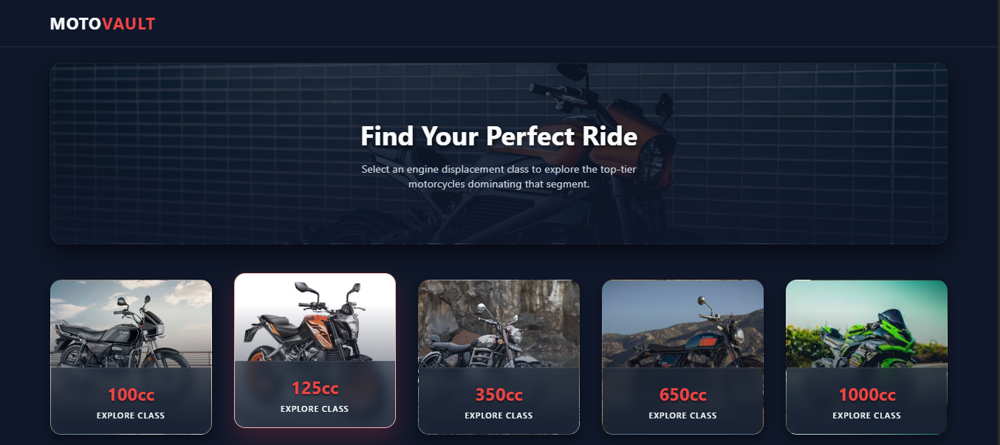
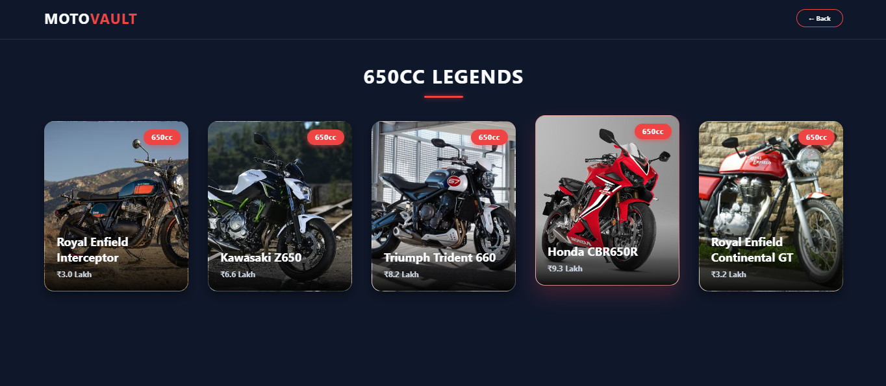
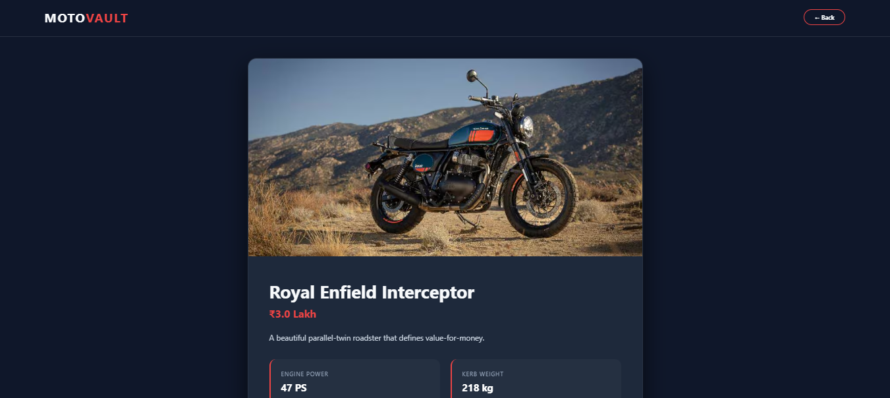

# MotoVault - Premium Bike Explorer 🏍️

MotoVault is a sleek, static Single-Page Application (SPA) built entirely with pure HTML, CSS, and JavaScript. It provides a thrilling and premium user interface to explore top-tier motorcycles categorized by engine displacement—ranging from 100cc daily commuters to 1000cc track-focused superbikes.

## 📸 Previews

Here is a look at the MotoVault interface:

### 1. Home Screen & Categories


### 2. Category Bike List


### 3. Bike Details View


## ✨ Features

- **Single-Page Architecture (SPA):** Seamless navigation between categories, lists, and details without ever reloading the browser.
- **Glassmorphism UI:** Frosted glass effects combined with a sleek dark mode theme tailored for the motorcycle aesthetic.
- **Dynamic Backgrounds:** Category and bike cards use actual motorcycle images as backgrounds with smart gradient overlays for text readability.
- **Smooth Animations:** Premium hover interactions, scaling effects, and fade-in transitions.
- **No External Dependencies:** Built purely with vanilla HTML, CSS, and JavaScript. 

## 🛠️ Tech Stack

- **HTML5:** Semantic structure.
- **CSS3:** Custom variables, Flexbox/Grid layouts, animations, and backdrop filters.
- **JavaScript (Vanilla):** State management, DOM manipulation, and view routing.

## 🚀 How to Run Locally

Since this is a completely static website, you don't need to install any servers, Node modules, or databases to run it.

1. **Clone the repository:**
   ```bash
   git clone [https://github.com/nileshbhurewar/MotoVault---The-static-Website.git](https://github.com/nileshbhurewar/MotoVault---The-static-Website.git)
